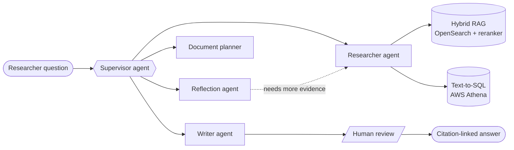

  

  

  
  
  

I build production LLM systems that people actually use. I have 4+ years in software and data engineering, including 2+ years shipping multi-agent GenAI at **Thoughtworks** for Bayer, where RAG, Text-to-SQL and NER run against **18,000+ preclinical safety studies**. I'm now doing an MS in AI (ML specialization) at Northeastern's **Khoury College** and working as a Research Assistant at the **AIMES Lab**.

> 🔍 **Open to Spring 2027 Agentic AI internships.** See my [portfolio](https://bernice511.github.io) or [reach out](mailto:bernicemalaiarasu@gmail.com).

## 🔭 What I'm Working On
- 📰 **[NewsroomFeed](https://newsroomfeed.duckdns.org/)** (AIMES Lab): a LangGraph pipeline that turns live civic feeds (MassDOT, NWS, Boston 311) into hyperlocal AI news. A journalist approves every item before it publishes. Shipped as a Next.js PWA.
- 🎓 **Husky AI** (AIMES Lab): a platform where students practice prompt engineering through interactive exercises and guided feedback.

## 🧪 Selected Projects
| Project | What it does | Highlight |
|---|---|---|
| [**Entiscribe**](https://github.com/bernice511/entiscribe) | Extracts user-defined entities from PDFs with an LLM, evaluates the extraction, and links entities into a knowledge graph | LangGraph · runs fully local, no API keys |
| [**Crisis-Aware Dialogue**](https://github.com/bernice511/crisis-aware-dialogue) | Routes distress-signal input with a RoBERTa classifier into a QLoRA-fine-tuned Llama-3.2-1B | 0.920 F1 at ~1/100th of GPT-5's size |
| [**Delivery Delay Prediction**](https://github.com/bernice511/delivery_prediction) | Two-stage XGBoost that flags late Olist orders before they ship, with a SHAP-explained Streamlit dashboard | 0.922 ROC-AUC on 100K+ orders |
| [**Job Applier**](https://github.com/bernice511/jobApplier) | Tailors resumes and cover letters to real JDs, with guardrails against fabrication | Human-in-the-loop, never auto-submits |

## 🚀 Featured: PRINCE @ Thoughtworks for Bayer
**PRINCE (Preclinical Information Centre)** is a supervisor-orchestrated multi-agent knowledge engine used in Bayer's daily preclinical drug-safety research. I worked on it from 2022 to 2025, first on its data platform and then leading development of the GenAI system. It won the 🏆 **Bayer GenAI Award for Best Technical Implementation** (2025).

| | |
|---|---|
| 🔎 **Hybrid RAG** | 0.7 vector / 0.3 keyword search over 100 GB+ of biomedical data, re-ranked with bge-reranker |
| 🧮 **Text-to-SQL** | Dynamic few-shot prompting against AWS Athena, **90%+ accuracy** |
| 🏷️ **NER extraction** | Metadata pulled from study reports, **98%+ accuracy across 40+ fields** |
| ✅ **Eval as a CI gate** | RAGAS + DeepEval on every change, with Langfuse tracing |
| 📈 **Impact** | Ad-hoc data requests went from days to minutes, and complex queries got 30% faster |

## 🛠 Tech Stack
**GenAI** 
        

**Languages & Frameworks** 
        

**Cloud & Data** 
        

<b>🎤 Speaking & Mentorship</b>

 

- **XConf, Thoughtworks Bangalore (Aug 2025):** PRINCE's multi-agent architecture and LLM evaluation strategies
- **GenAI Workshop Facilitator (Mar 2025):** designed and delivered a hands-on LLM & RAG workshop for 50+ developers
- **GeekNight (Dec 2024):** improving Text-to-SQL accuracy with dynamic few-shot prompting, for 80+ engineers

<b>📚 Writing & Recognition</b>

 

- 📝 **[From Unstructured to Structured: Adobe PDF Extract API for Data Transformation](https://dev.to/theblogsquad/from-unstructured-to-structured-adobe-pdf-extract-api-for-data-transformation-1n08)** on *Dev.to*: a practical guide to turning messy PDF data into clean, usable formats.
- 📄 **Frontiers in Artificial Intelligence (2025):** PRINCE is described in the peer-reviewed paper *[From data silos to insights: the PRINCE multi-agent knowledge engine for preclinical drug development](https://doi.org/10.3389/frai.2025.1636809)*, which acknowledges my contributions as part of the Thoughtworks team.

## 💬 Ask me about
Building multi-agent systems, LLM evaluation, the move from Chennai to Boston, or my dream of building a RAG-based search engine for my fictional book multiverse.

## 📊 GitHub Stats

  
  

